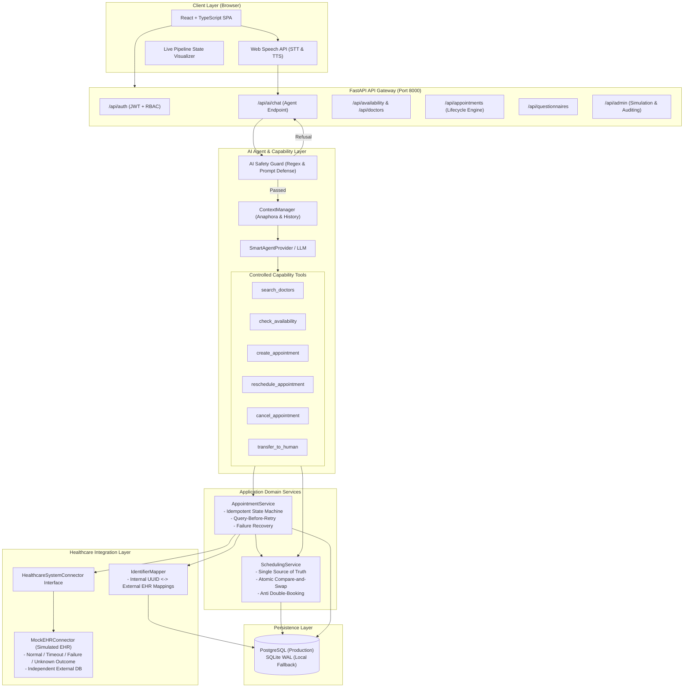

# System Architecture — CareFlow AI

CareFlow AI is an autonomous, reliable, production-grade healthcare patient intake, scheduling, and pre-visit voice agent platform.

It is architecturally engineered around one core principle: **The AI must never invent availability, guess clinical parameters, or bypass strict healthcare system consistency constraints.**

---

## 1. High-Level Architecture Overview



---

## 2. Multi-Tier Layer Responsibilities

| Tier | Component | Responsibilities |
| :--- | :--- | :--- |
| **Client** | React 19 SPA + Web Speech API | Provides voice input (STT), voice feedback (TTS), barge-in interruption, live pipeline state visualizer, interactive slot selection cards, confirmation banners, and role portals. |
| **API Gateway** | FastAPI | Central routing, CORS handling, JWT token verification, RBAC role enforcement, and hospital tenant boundary checks. |
| **Safety & Policy** | `AISafetyGuard` | Strict pre-LLM message inspection. Instantly rejects medical diagnosis, prescription requests, drug modifications, and prompt injection attacks. |
| **Agent / LLM** | `AIAgent` & `SmartAgentProvider` | Maintains multi-turn conversation context (`AIContext`), resolves anaphoric references (e.g. "book the first one", "make that Friday 4 PM"), and invokes authorized capabilities. |
| **Capability Layer** | `BaseCapability` Tools | Explicit, controlled tools (`search_doctors`, `check_availability`, `create_appointment`, `cancel_appointment`, `reschedule_appointment`). Logs every execution to `capability_executions` table with millisecond timing. |
| **Scheduling Engine** | `SchedulingService` | The **single source of truth** for all bookable slots. AI never invents availability. Enforces doctor status, hospital status, calendar status, leave periods, and atomic compare-and-swap reservation. |
| **Appointment Service** | `AppointmentService` | Manages appointment state machine (`PENDING` $\to$ `CONFIRMED` / `FAILED` / `RECONCILIATION_REQUIRED`), idempotency key verification, correlation ID tracking, and unknown-outcome recovery. |
| **Healthcare Connector** | `MockEHRConnector` | Pluggable interface (`HealthcareSystemConnector`). Simulates external hospital EHR systems with configurable fault injection (`NORMAL`, `TIMEOUT`, `FAILURE`, `UNKNOWN_OUTCOME`). |
| **Data Layer** | PostgreSQL & SQLite | Multi-tenant schema with strict indexes on tenant keys, slot uniqueness, external IDs, and operation logs. |

---

## 3. Concurrency & Double-Booking Prevention

Double-booking is prevented using **atomic compare-and-swap operations**:
1. When a patient selects a slot, `SchedulingService.revalidate_and_reserve_slot(db, slot_id)` is invoked.
2. An atomic SQL update is executed:
   ```sql
   UPDATE availability_slots 
   SET is_booked = TRUE 
   WHERE id = :slot_id AND is_booked = FALSE;
   ```
3. If rowcount is `0`, another concurrent request already reserved the slot. The transaction immediately rolls back and raises an HTTP `409 Conflict` error.
4. On PostgreSQL, row-level locks (`with_for_update()`) protect against simultaneous reads. On SQLite, thread-safe synchronization locks ensure strict serialized transactions.
5. In automated tests, 2 simultaneous worker threads targeting the identical slot execute in parallel: exactly 1 succeeds with `CONFIRMED`, exactly 1 receives `409 Conflict`, and exactly 1 appointment exists in the database.

---

## 4. Multi-Tenant Isolation Architecture

CareFlow AI enforces multi-tenancy at every level:
- **Tenant Scope**: Every hospital-scoped model (`Doctor`, `AvailabilitySlot`, `Appointment`, `Questionnaire`, `Workflow`, `IntegrationOperation`, `ReconciliationRecord`) contains a mandatory foreign key `hospital_id`.
- **Backend Authorization**:
  - `PLATFORM_ADMIN`: Has platform-wide access across all hospitals.
  - `HOSPITAL_ADMIN`: Can only view, configure, and manage resources matching their assigned `hospital_id`. Attempting to access another hospital's data returns HTTP `403 Forbidden`.
  - `DOCTOR`: Can only access their own appointments, calendar, and authorized pre-visit intake records.
  - `PATIENT`: Can only view and modify their own patient profile and appointments.
