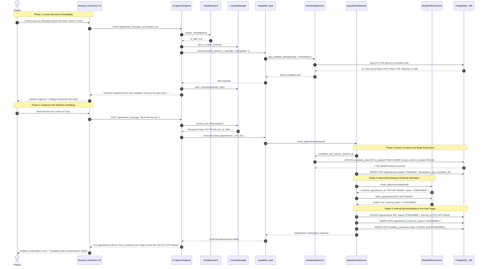

# End-to-End Booking Sequence — CareFlow AI

This sequence document illustrates the complete patient booking journey through CareFlow AI.

---

## 1. Sequence Diagram

---

## 2. Key Transactional Invariants

1. **AI Never Emits Fake Slots**: Every slot presented to the patient originated directly from a live `AvailabilitySlot` record in the database.
2. **Double-Booking Impossibility**: Even if two patients select the same slot at the exact same millisecond, the atomic database compare-and-swap guarantees only one update returns `1`. The second receives `409 Conflict` and no duplicate EHR appointment is ever created.
3. **External Verification**: Internal status does not transition to `CONFIRMED` until the external EHR connector has independently confirmed the appointment exists and is valid.
4. **Automated Pre-Visit Trigger**: Upon confirmation, CareFlow AI assigns the specialty-specific intake questionnaire and registers a post-booking workflow.
