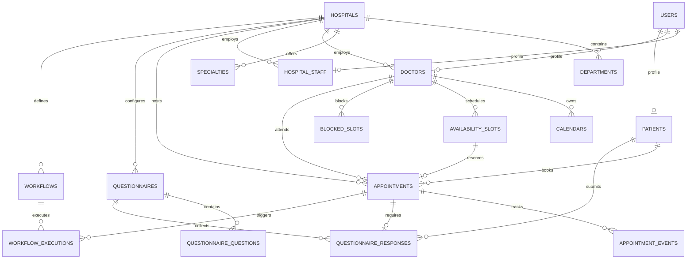

# Data Model Specification — CareFlow AI

This document details the relational data model for CareFlow AI. All major entities use UUID primary keys, explicit tenant ownership (`hospital_id`), and UTC timestamps.

---

## 1. Entity-Relationship Diagram (ERD)

---

## 2. Table Schemas & Specifications

### 2.1 Identity & Tenants
- **`users`**: Platform accounts. Roles: `PLATFORM_ADMIN`, `HOSPITAL_ADMIN`, `DOCTOR`, `PATIENT`. Contains hashed passwords (`bcrypt`), email (unique), active flag.
- **`hospitals`**: Tenant boundaries. Columns: `id`, `name`, `status` (`PENDING`, `APPROVED`, `SUSPENDED`), `city`, `external_facility_id` (`EXT-FAC-CITYCARE`).
- **`hospital_staff`**: Maps a User to a specific Hospital tenant.

### 2.2 Clinical Providers & Calendars
- **`doctors`**: Physician profiles. Columns: `hospital_id`, `user_id`, `specialty_id`, `name`, `qualification`, `experience_years`, `consultation_fee`, `status` (`ACTIVE`, `INACTIVE`), `external_provider_id` (`EXT-DOC-RAO-01`).
- **`calendars`**: Consultation schedule container. Columns: `hospital_id`, `doctor_id`, `is_active`.
- **`availability_slots`**: Bookable consultation time slots. Columns: `hospital_id`, `doctor_id`, `calendar_id`, `start_time` (UTC), `end_time` (UTC), `is_booked`, `is_blocked`.
- **`blocked_slots`**: Doctor leave or blocked time periods preventing booking.

### 2.3 Appointments & Lifecycle
- **`appointments`**: The transactional healthcare appointment.
  - `hospital_id`, `patient_id`, `doctor_id`, `slot_id` (foreign key with index).
  - `status`: `PENDING`, `CONFIRMED`, `RESCHEDULED`, `CANCELLED`, `COMPLETED`, `SYNCHRONIZATION_PENDING`, `RECONCILIATION_REQUIRED`, `FAILED`.
  - `external_appointment_id`: Reference in Mock EHR (`EXT-APT-xxx`).
  - `idempotency_key`: Deduplication token (unique index).
  - `correlation_id`: Distributed transaction tracer.
- **`appointment_events`**: Immutable state transition audit trail (`from_status`, `to_status`, `reason`, `timestamp`).

### 2.4 Pre-Visit Intake & Workflows
- **`questionnaires`**: Clinical intake templates. Scope: `hospital_id`, `specialty_id`, `title`, `is_active`.
- **`questionnaire_questions`**: Intake questions. Columns: `question_type` (`YES_NO`, `CHOICE`, `NUMERIC`, `SHORT_TEXT`), `prompt`, `options_json`, `order_index`.
- **`questionnaire_responses`**: Patient submitted answers. Columns: `appointment_id`, `patient_id`, `answers_json`, `status` (`COMPLETED`), `completed_at`.
- **`workflows`** & **`workflow_executions`**: Automation triggered on `APPOINTMENT_CONFIRMED`.

### 2.5 Observability & Integration
- **`integration_operations`**: Audit log of external EHR calls (`operation_type`, `correlation_id`, `status`, `latency_ms`).
- **`reconciliation_records`**: Queue of unresolved or timeout discrepancies for administrative action.
- **`audit_events`**: Global security and safety event logs (e.g. `AI_SAFETY_VIOLATION_BLOCKED`, `QUESTIONNAIRE_SUBMITTED`).
- **`external_identifier_mappings`**: Mapping internal UUIDs to EHR strings (`EXT-PAT-...`, `EXT-DOC-...`).
