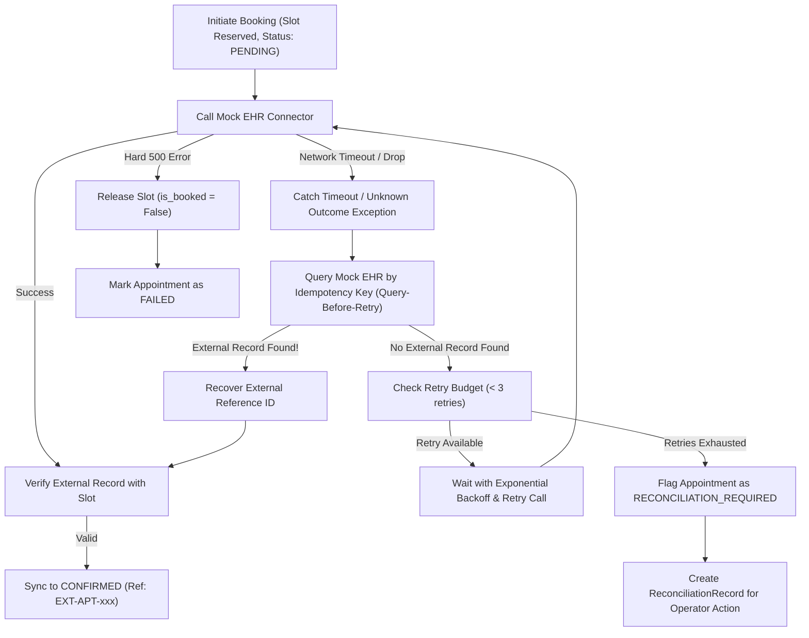

# Failure Recovery & Reconciliation — CareFlow AI

In real-world healthcare engineering, the most dangerous failure mode is the **Unknown Outcome**: the client issues a booking request, the external EHR successfully creates the appointment, but a network blip or gateway timeout prevents the client from receiving the confirmation.

If a naive system blindly retries the booking, it creates a **duplicate external appointment**. If it marks the booking as failed, the patient misses the appointment while the doctor's calendar remains blocked.

CareFlow AI solves this with **Query-Before-Retry Recovery**.

---

## 1. The Query-Before-Retry State Machine

---

## 2. Automated Test Verification Results

The recovery behavior is validated in `tests/test_ehr_and_appointments.py`:

1. **`test_unknown_outcome_recovery_prevents_duplicate_appointment`**:
   - Mock EHR simulation mode set to `UNKNOWN_OUTCOME`.
   - Booking initiated for Dr. Rao.
   - Client catches timeout, initiates `_recover_and_verify(db, appt, correlation_id)`.
   - Connector queries external database by `idempotency_key`, finds the external record, verifies that doctor, facility, and time match.
   - Appointment state updates to `CONFIRMED`.
   - **Verification**: Exactly 1 internal appointment exists, and exactly 1 external appointment exists in Mock EHR. Zero duplicate appointments created!

2. **`test_unrecoverable_timeout_creates_reconciliation_record`**:
   - Mock EHR simulation mode set to `TIMEOUT` (no record created externally).
   - Booking initiated. System queries Mock EHR, confirms no record exists.
   - Retries exhausted. System flags appointment as `RECONCILIATION_REQUIRED`.
   - `ReconciliationRecord` created with reason `"EHR booking failed: External Mock EHR timed out after 3 retries."`
   - Visible immediately on Platform Admin Dashboard for operator review.
